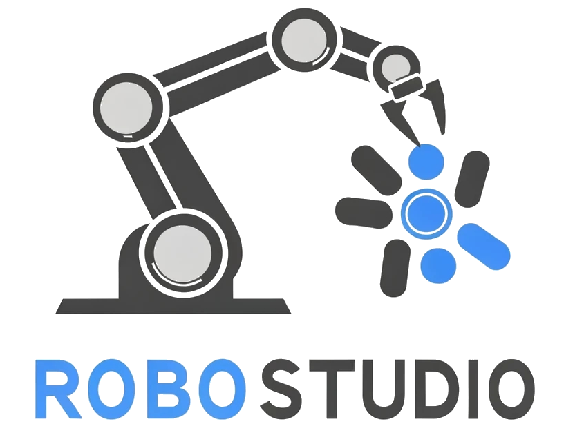

<div align="center"><h2>RoboStudio: A Physics Consistent World Model for Robotic Arm with Hybrid Representation</h2></div>


<p align="center">
    <a href='https://open-air-sun.github.io/mars/static/data/MARS-poster.pdf'>
        
    <!-- community badges -->
    <a href="https://open-air-sun.github.io/mars/"></a>
    <!-- doc badges -->
    <a href="https://arxiv.org/abs/2307.15058">
        
    </a>
    <a href="https://pypi.org/project/mars-nerfstudio/"></a>

</p>

<!-- replace the nerfstudio logo with Robostudio logo -->

<div align="center">
<picture>
    <source media="(prefers-color-scheme: dark)" srcset="docs/_static/imgs/logo-rs.png" />
    
</picture>
</div>


<div align="center">
  
</div>

# About

_It’s as simple as plug and play with robostudio!_


# Quickstart

TODO: what will the below content go through


## 1. Installation: Setup the environment

### Prerequisites

You must have an NVIDIA video card with CUDA installed on the system. This library has been tested with version 11.8 of CUDA. You can find more information about installing CUDA [here](https://docs.nvidia.com/cuda/cuda-quick-start-guide/index.html)

### Create environment

Nerfstudio requires `python >= 3.8`. We recommend using conda to manage dependencies. Make sure to install [Conda](https://docs.conda.io/miniconda.html) before proceeding.

```bash
conda create --name robostudio -y python=3.8
conda activate robostudio
pip install --upgrade pip
```

### Dependencies

Install PyTorch with CUDA (this repo has been tested with CUDA 11.7 and CUDA 11.8) and [tiny-cuda-nn](https://github.com/NVlabs/tiny-cuda-nn).
`cuda-toolkit` is required for building `tiny-cuda-nn`.

For CUDA 11.8:

```bash
pip install torch==2.1.2+cu118 torchvision==0.16.2+cu118 --extra-index-url https://download.pytorch.org/whl/cu118

conda install -c "nvidia/label/cuda-11.8.0" cuda-toolkit
pip install ninja git+https://github.com/NVlabs/tiny-cuda-nn/#subdirectory=bindings/torch
```

### Installing nerfstudio

Easy option:

```bash
pip install robostudio
```

**OR** if you want the latest and greatest:

```bash
git clone https://github.com/RoboOmniSim/Robostudio.git
cd Robostudio
pip install --upgrade pip setuptools
pip install -e .
```


## 2. Training your first model!

TODO:

```bash
TODO
```

If everything works, you should see training progress like the following:

<p align="center">
    
</p>

Navigating to the link at the end of the terminal will load the webviewer. If you are running on a remote machine, you will need to port forward the websocket port (defaults to 7007).

<p align="center">
    
</p>

### Resume from checkpoint / visualize existing run

It is possible to load a pretrained model by running

```bash
ns-train nerfacto --data data/nerfstudio/poster --load-dir {outputs/.../nerfstudio_models}
```

## Visualize existing run

Given a pretrained model checkpoint, you can start the viewer by running

```bash
ns-viewer --load-config {outputs/.../config.yml}
```

## 3. Exporting Results

Once you have a NeRF model you can either render out a video or export a point cloud.

### Render Video

First we must create a path for the camera to follow. This can be done in the viewer under the "RENDER" tab. Orient your 3D view to the location where you wish the video to start, then press "ADD CAMERA". This will set the first camera key frame. Continue to new viewpoints adding additional cameras to create the camera path. We provide other parameters to further refine your camera path. Once satisfied, press "RENDER" which will display a modal that contains the command needed to render the video. Kill the training job (or create a new terminal if you have lots of compute) and run the command to generate the video.

Other video export options are available, learn more by running

```bash
ns-render --help
```

### Generate Point Cloud

While NeRF models are not designed to generate point clouds, it is still possible. Navigate to the "EXPORT" tab in the 3D viewer and select "POINT CLOUD". If the crop option is selected, everything in the yellow square will be exported into a point cloud. Modify the settings as desired then run the command at the bottom of the panel in your command line.

Alternatively you can use the CLI without the viewer. Learn about the export options by running

```bash
ns-export pointcloud --help
```

## 4. Using Custom Data

TODO

## 5. Advanced Options

### Training models other than nerfacto

We provide other models than nerfacto, for example if you want to train the original nerf model, use the following command

```bash
ns-train vanilla-nerf --data DATA_PATH
```

For a full list of included models run `ns-train --help`.

### Modify Configuration

Each model contains many parameters that can be changed, too many to list here. Use the `--help` command to see the full list of configuration options.

```bash
ns-train nerfacto --help
```

### Tensorboard / WandB / Viewer

We support four different methods to track training progress, using the viewer[tensorboard](https://www.tensorflow.org/tensorboard), [Weights and Biases](https://wandb.ai/site), and ,[Comet](https://comet.com/?utm_source=nerf&utm_medium=referral&utm_content=github). You can specify which visualizer to use by appending `--vis {viewer, tensorboard, wandb, comet viewer+wandb, viewer+tensorboard, viewer+comet}` to the training command. Simultaneously utilizing the viewer alongside wandb or tensorboard may cause stuttering issues during evaluation steps. The viewer only works for methods that are fast (ie. nerfacto, instant-ngp), for slower methods like NeRF, use the other loggers.

# Learn More

And that's it for getting started with the basics of Robostudio.

## Adding Datasets

TODO


# Supported Features


# Built On
<a href="https://github.com/nerfstudio-project/nerfstudio">
<picture>
    <source media="(prefers-color-scheme: dark)" srcset="https://raw.githubusercontent.com/nerfstudio-project/nerfstudio/main/docs/_static/imgs/logo-dark-ns.png" />
    
</picture>
</a>

 
# Citation

TODO
You can find a paper writeup of the framework on [arXiv](https://arxiv.org/abs/2302.04264).

If you use this library or find the documentation useful for your research, please consider citing:

TODO
```
@inproceedings{nerfstudio,
	title        = {Nerfstudio: A Modular Framework for Neural Radiance Field Development},
	author       = {
		Tancik, Matthew and Weber, Ethan and Ng, Evonne and Li, Ruilong and Yi, Brent
		and Kerr, Justin and Wang, Terrance and Kristoffersen, Alexander and Austin,
		Jake and Salahi, Kamyar and Ahuja, Abhik and McAllister, David and Kanazawa,
		Angjoo
	},
	year         = 2023,
	booktitle    = {ACM SIGGRAPH 2023 Conference Proceedings},
	series       = {SIGGRAPH '23}
}
```

# Contributors

<a href="https://github.com/RoboOmniSim/Robostudio/graphs/contributors">
  
</a>
